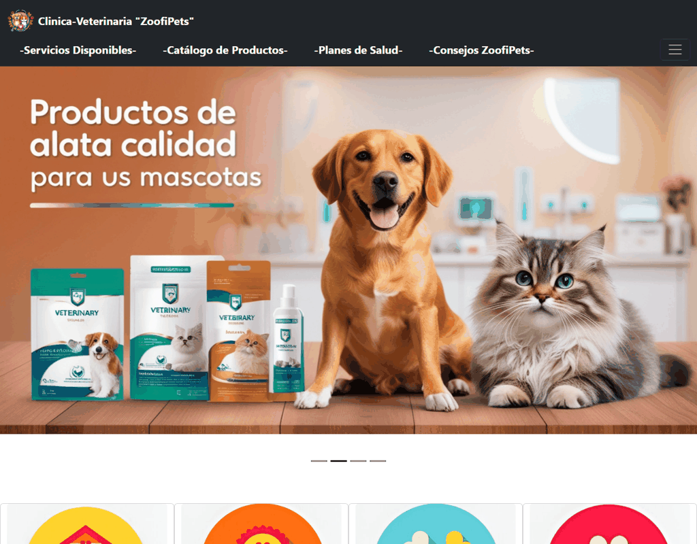
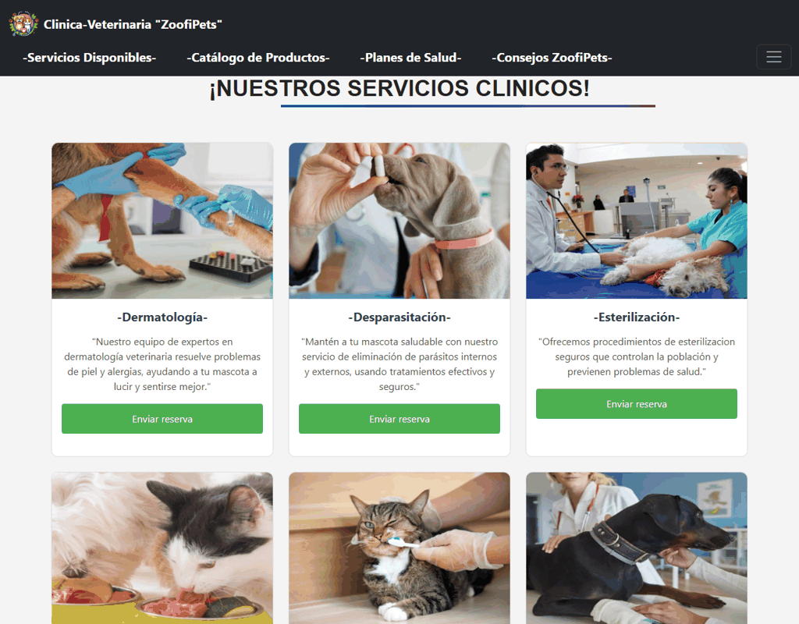
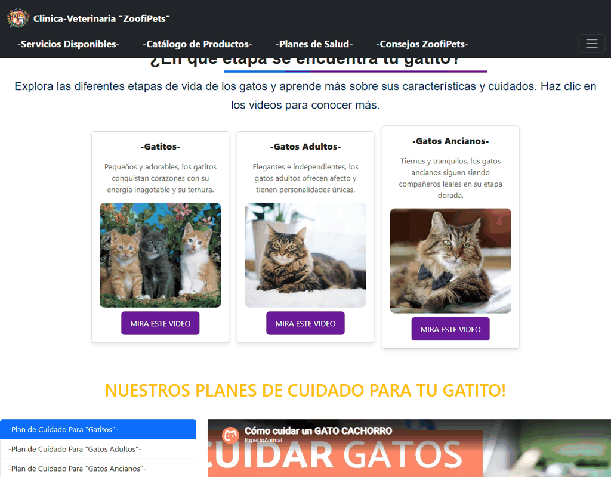
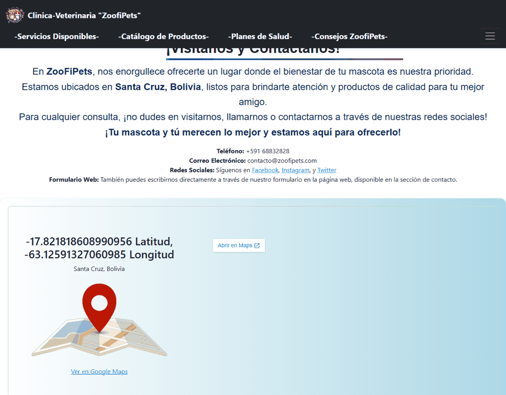
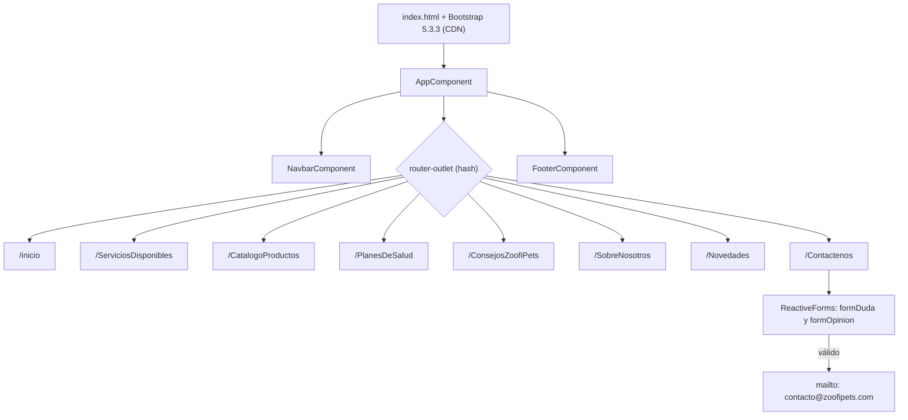

<div align="center">
  
  <h1>VetLanding</h1>
  <p><b>Sitio informativo de la clínica veterinaria ZoofiPets: servicios, productos, planes de salud, consejos y contacto.</b></p>

  
  
  
  

  <p>
    <a href="#-inicio-rápido">Inicio rápido</a> ·
    <a href="#-características">Características</a> ·
    <a href="#-arquitectura">Arquitectura</a> ·
    <a href="#-pruebas">Pruebas</a> ·
    <a href="#-lo-que-todavía-no-existe">Limitaciones</a>
  </p>
</div>

VetLanding es la puerta de entrada pública de una clínica veterinaria (marca **ZoofiPets**, Santa Cruz, Bolivia): un cliente potencial encuentra qué se ofrece, cómo contactar y dónde está, sin cuenta ni backend. **Es** una single-page application Angular 19 compilada a archivos estáticos. **No es** un sistema de reservas ni una tienda: no hay servidor, base de datos ni pagos.

## 🎬 Vista rápida

Capturas reales de la aplicación compilada (`ng build`) y servida en local, en un navegador de escritorio.

| Inicio | Servicios |
| :---: | :---: |
|  |  |
| **Planes de salud** | **Contáctenos** |
|  |  |

## ✨ Características

| Característica | Detalle |
| --- | --- |
| **Inicio** | Carrusel automático y accesos a las secciones principales. |
| **Servicios disponibles** | Listado de servicios clínicos con tarjetas por servicio. |
| **Catálogo de productos** | Página con los productos de la tienda de la clínica. |
| **Planes de salud** | Planes de cuidado por etapa de vida para perros y gatos, con enlaces a videos de YouTube. |
| **Consejos ZoofiPets** | Contenido educativo de cuidado de mascotas. |
| **Sobre nosotros y Novedades** | Misión, visión, equipo y novedades de la clínica. |
| **Contáctenos** | Dirección, teléfono, correo, redes, mapa de Google Maps embebido y **dos formularios con validación real** (nombre, correo, tipo, mensaje y confirmación). |
| **Navegación** | Rutas con hash (`#/inicio`, `#/PlanesDeSalud`, ...), menú superior y menú lateral, y enlace "Saltar al contenido principal". |

## 🏗️ Arquitectura

Angular con módulos (`NgModule`, no standalone): `AppModule` declara la barra, el pie y ocho páginas; el router usa `useHash: true`, por lo que se puede servir desde cualquier hosting estático sin reglas de reescritura.



<details>
<summary>Estructura de carpetas</summary>

```text
src/app/
  components/   navbar, footer
  pages/        inicio, servicios-disponibles, catalogo-productos, planes-de-salud,
                consejos-zoofi-pets, sobre-nosotros, novedades, contactenos
  app-routing.module.ts   rutas con useHash: true (cualquier ruta desconocida muestra Inicio)
public/         imágenes y recursos estáticos del sitio
```

</details>

## 🚀 Inicio rápido

| Requisito | Versión |
| --- | --- |
| Node.js + npm | Compatible con Angular CLI 19 |
| Google Chrome | Solo para las pruebas |

```bash
git clone https://github.com/Luiss2080/VetLanding.git
cd VetLanding
npm ci            # o npm install
npm start         # desarrollo en http://localhost:4200/
npm run build     # producción: dist/app-sistema
```

Para servir el resultado de `npm run build`, publica el contenido de `dist/app-sistema/browser/` en cualquier servidor de archivos estáticos.

<details>
<summary>Verificado en este repositorio</summary>

`npm ci` y `ng build` terminaron sin errores (bundle inicial de unos 487 kB sin comprimir); el sitio compilado se sirvió con un servidor estático y se capturó en Chrome headless; `ng test` corrió en ChromeHeadless con 16 de 16 pruebas correctas.

</details>

## 🧪 Pruebas

```bash
npm test                                                   # Karma en modo watch
npx ng test --watch=false --browsers=ChromeHeadless        # una sola corrida (CI)
```

Karma + Jasmine, **16 pruebas**: creación de cada componente de página, layout de `AppComponent` (barra, pie y `router-outlet`) y la validación de los formularios de contacto (rechazo de campos vacíos o sin confirmar, y apertura del cliente de correo con un envío válido). No hay pruebas E2E ni workflow de CI en el repositorio.

## 🔒 Seguridad

Es un sitio estático sin autenticación ni datos del servidor. Los formularios de contacto no envían nada a ningún servidor: al ser válidos, abren `mailto:` en el cliente de correo de quien visita. Bootstrap se carga desde CDN con `integrity` (SRI).

## 🚧 Lo que todavía no existe

- **Solo los formularios de "Contáctenos" hacen algo.** Los botones "Enviar reserva", el formulario de "Reservar" de Servicios y los campos "Enviar" de otras páginas son formularios sin manejador: no reservan ni envían nada.
- **Sin backend**: no hay reservas de citas, pedidos, pagos ni envío real de mensajes; el contacto depende de que la persona tenga un cliente de correo configurado.
- **Encabezados**: varias páginas usan más de un `<h1>` y saltan niveles de encabezado por razones visuales; no se renumeraron para no romper el CSS.
- **Contraste y accesibilidad**: no se auditaron con Lighthouse o axe por página.
- **Recursos pesados**: la carpeta `public/` pesa cerca de 139 MB en el repositorio (imágenes y videos), lo que encarece clonar y desplegar.
- **Dependencias por CDN**: Bootstrap y el mapa de Google necesitan conexión a Internet.
- **Textos**: hay erratas visibles en el contenido (por ejemplo, el banner de inicio) que no se han corregido.
- Sin CI y sin pruebas E2E.

## 📄 Licencia

Sin licencia definida: todos los derechos reservados por defecto.

<div align="center">
  <sub>Hecho por Luiss2080 · Angular 19 + Bootstrap</sub>
</div>
